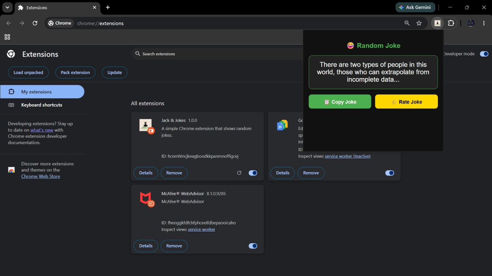

# 😂 Jack & Jokes - Chrome Extension

A lightweight and fun Chrome Extension that delivers random jokes instantly to brighten your day.

## 📸 Preview



---

## ✨ Features

- 🎭 Fetches random jokes from an online joke API
- 📋 One-click Copy Joke button
- 🔔 Toast notification: "Successfully Copied!"
- ⭐ Rate every joke from 1–5 stars
- ⚡ Fast and lightweight
- 🎨 Clean and modern user interface
- 🧩 Easy-to-install Chrome Extension

---

## 🚀 Installation

### Method 1: Install from Source

1. Download or clone this repository.

```bash
git clone https://github.com/ASHWANIKUMARGUPTA14830/JackAndJokes-ChromeExtension.git
```

2. Open Google Chrome.

3. Navigate to:

```text
chrome://extensions/
```

4. Enable **Developer Mode**.

5. Click **Load Unpacked**.

6. Select the project folder.

7. The extension will appear in your Chrome toolbar.

---

## 🛠️ Tech Stack

- HTML5
- CSS3
- JavaScript (ES6)
- Chrome Extension API
- Joke API

---

## 📂 Project Structure

```text
JackAndJokes-ChromeExtension/
│
├── JOKES.html
├── script.js
├── style.css
├── manifest.json
├── logo.png
│
└── asset/
    └── Chrome_Extension.jpeg
```

---

## 🎯 How It Works

1. User clicks the extension icon.
2. A random joke is fetched from the API.
3. The joke is displayed instantly.
4. User can:
   - Copy the joke
   - Rate the joke
   - Receive a success toast after copying

---

## 📈 Future Enhancements

- 🔄 Next Joke Button
- ❤️ Favorite Jokes
- 📤 Share Joke Feature
- 🌙 Dark/Light Mode
- 📊 Joke Analytics
- 🏆 Top Rated Jokes

---

## 👨‍💻 Developer

**Ashwani Kumar Gupta**

- 🎓 B.Tech CSE, Lovely Professional University
- 💻 Software Developer
- 🤖 AI/ML & Android Development Enthusiast

### Connect With Me

- GitHub: https://github.com/ASHWANIKUMARGUPTA14830
- LinkedIn: https://www.linkedin.com/in/ashwani-kumar-gupta-7304ab296/

---

## ⭐ Support

If you found this project useful, please consider giving it a **Star ⭐** on GitHub.

It helps motivate future development and improvements.

---

## 📜 License

This project is open-source and available under the MIT License.
